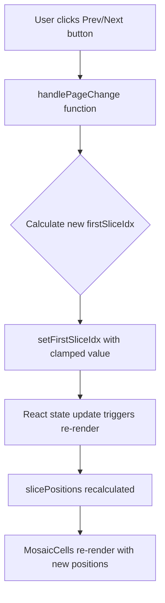
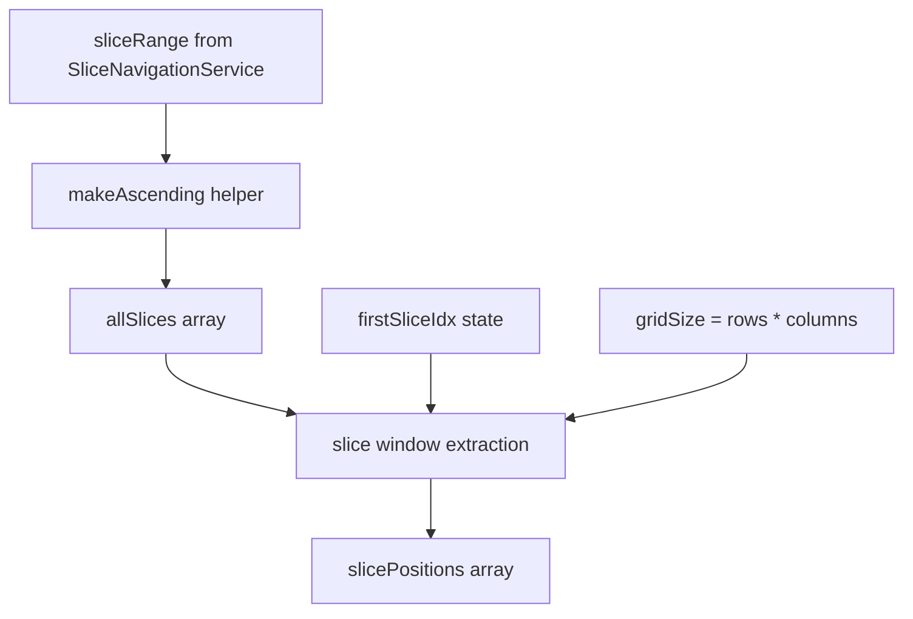
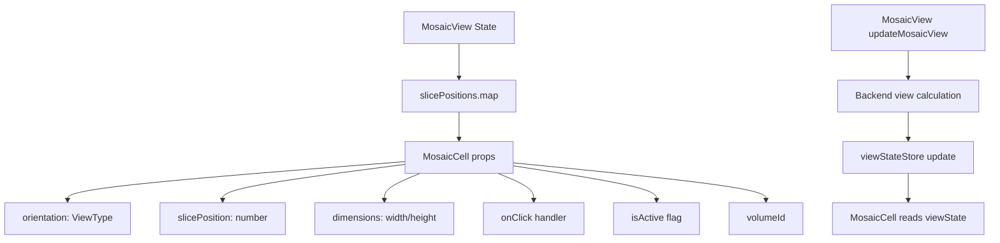
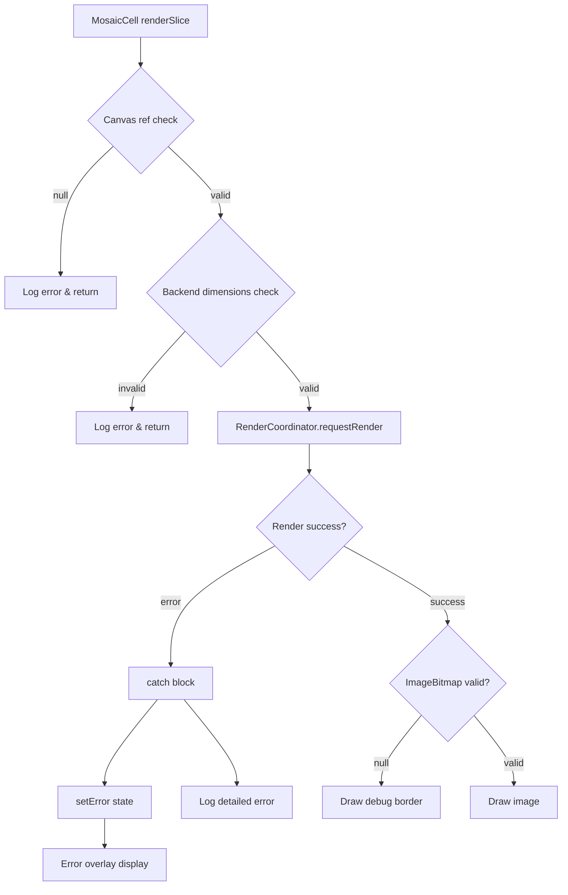
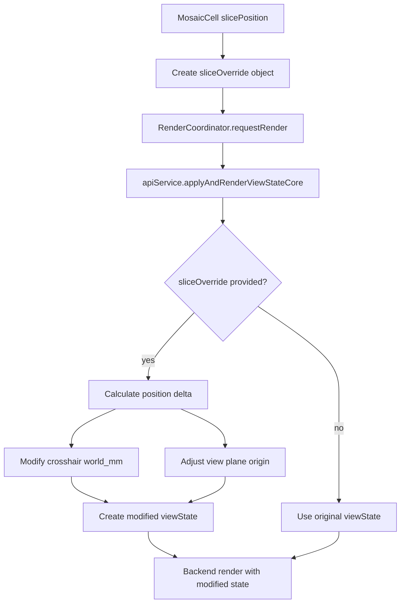

# MosaicView Component Execution Flow Analysis

## Overview

This report maps the execution flow of the MosaicView component with specific focus on:
1. Navigation button click handlers and state updates
2. Slice position calculations from firstSliceIdx
3. Data flow from MosaicView to MosaicCell rendering
4. Error propagation when slice rendering fails

## 1. Navigation Button Click Handlers and State Updates

### Flow Sequence



### Implementation Details

**Button Click Handler (lines 666-684)**
```typescript
<button
  onClick={() => handlePageChange(-1)}  // Prev button
  disabled={firstSliceIdx === 0}
>
  ← Prev
</button>

<button  
  onClick={() => handlePageChange(1)}   // Next button
  disabled={firstSliceIdx + gridSize >= allSlices.length}
>
  Next →
</button>
```

**handlePageChange Function (lines 570-573)**
```typescript
const handlePageChange = (delta: number) => {
  setFirstSliceIdx(idx => clamp(idx + delta * gridSize, 0, firstSliceIdxMax));
};
```

### State Management Issues

1. **Window-based Navigation vs Page-based UI**
   - The implementation uses a sliding window approach (`firstSliceIdx`)
   - UI still displays "Slice X / Y" suggesting single slice navigation
   - Button delta multiplies by `gridSize` for page-like navigation

2. **Edge Case Handling**
   - `firstSliceIdxMax` calculated as `Math.max(0, allSlices.length - gridSize)` (line 526)
   - Prevents navigating past the last full page of slices
   - Disabled state properly prevents invalid navigation

## 2. Slice Position Calculations from firstSliceIdx

### Calculation Flow



### Key Components

**Slice Range Generation (lines 494-501)**
```typescript
const sliceRange = useMemo(() => {
  try {
    return sliceNavService.getSliceRange(orientation);
  } catch (error) {
    console.warn(`[MosaicView] Failed to get slice range for ${orientation}`, error);
    return { min: -100, max: 100, step: 1, current: 0 };
  }
}, [orientation, layers, viewState.crosshair.world_mm]);
```

**All Slices Generation (lines 509-522)**
```typescript
const makeAscending = (min: number, max: number, step: number) => {
  const safeStep = Math.abs(step) || 1;
  const lo = Math.min(min, max);
  const hi = Math.max(min, max);
  const list: number[] = [];
  for (let v = lo; v <= hi; v += safeStep) list.push(v);
  return list;
};

const allSlices = useMemo(
  () => makeAscending(sliceRange.min, sliceRange.max, sliceRange.step),
  [sliceRange]
);
```

**Window Extraction (lines 533-536)**
```typescript
const slicePositions = useMemo(
  () => allSlices.slice(firstSliceIdx, firstSliceIdx + gridSize),
  [allSlices, firstSliceIdx, gridSize]
);
```

### Issues Identified

1. **makeAscending assumes positive steps** - May not handle negative slice ranges correctly
2. **No validation** that slice positions are within volume bounds
3. **Edge case** when `allSlices.length < gridSize` - partially filled grids

## 3. Data Flow from MosaicView to MosaicCell

### Component Hierarchy and Props Flow



### Key Data Flows

**1. View State Synchronization (lines 303-401)**
```typescript
const updateMosaicView = useMemo(
  () => throttle(async (cellWidth: number, cellHeight: number) => {
    // Single view update for all mosaic cells
    // All cells share viewState.views[orientation]
    
    const referenceView = await apiService.recalculateViewForDimensions(
      visibleLayer.volumeId,
      orientation,
      [512, 512], // Large reference dimensions
      currentState.viewState.crosshair.world_mm
    );
    
    // Update shared view state
    useViewStateStore.getState().setViewState(state => ({
      ...state,
      views: { ...state.views, [orientation]: updatedView }
    }));
  }, 200),
  [orientation]
);
```

**2. MosaicCell Render Request (lines 119-135)**
```typescript
const imageBitmap = await renderCoordinator.requestRender({
  viewState: viewState,
  viewType: orientation,
  width: backendDimensions[0],
  height: backendDimensions[1],
  reason: 'layer_change',
  priority: 'normal',
  sliceOverride: {
    axis: axisKey,
    position: slicePosition  // Each cell's unique slice
  }
});
```

### Data Flow Issues

1. **Shared View State**
   - All MosaicCells share same `viewState.views[orientation]`
   - Race conditions possible during rapid navigation
   - No per-cell view state caching

2. **Dimension Mismatch**
   - Parent calculates cell dimensions based on grid layout
   - Backend validates against its own dimension calculations
   - Canvas uses backend dimensions but styled to cell dimensions

## 4. Error Propagation When Slice Rendering Fails

### Error Flow Diagram



### Error Handling Implementation

**1. Validation Checks (lines 106-117)**
```typescript
if (!canvasRef.current) {
  console.error('[MosaicCell] Canvas ref not available');
  return;
}

const backendDimensions = viewState.views[orientation]?.dim_px;
if (!backendDimensions || backendDimensions[0] <= 0 || backendDimensions[1] <= 0) {
  console.error('[MosaicCell] Invalid backend dimensions:', backendDimensions);
  return;
}
```

**2. Render Error Handling (lines 227-230)**
```typescript
} catch (err) {
  console.error(`[MosaicCell] Failed to render slice at ${slicePosition}:`, err);
  setError(err instanceof Error ? err.message : 'Unknown error');
}
```

**3. Error Display (lines 267-273)**
```typescript
{error && (
  <div className="absolute inset-0 flex items-center justify-center bg-red-900/20">
    <div className="text-red-400 text-xs text-center p-2">
      Error: {error}
    </div>
  </div>
)}
```

### Error Propagation Issues

1. **Silent Failures**
   - Early returns don't set error state
   - User sees blank cell without error indication
   - No retry mechanism

2. **Limited Error Context**
   - Error messages are generic
   - No information about which validation failed
   - No correlation with parent state

3. **No Recovery Mechanism**
   - Once failed, cells don't retry
   - No fallback rendering
   - Parent component unaware of child failures

## 5. SliceOverride Mechanism Analysis

### How SliceOverride Modifies Rendering



### Implementation in apiService (from grep results)

```typescript
if (sliceOverride && viewType) {
  // Modify crosshair position
  const axisIndex = sliceOverride.axis === 'x' ? 0 : sliceOverride.axis === 'y' ? 1 : 2;
  const newWorldMm = [...viewState.crosshair.world_mm];
  const currentSlicePos = newWorldMm[axisIndex];
  const requestedSlicePos = sliceOverride.position;
  const sliceDelta = requestedSlicePos - currentSlicePos;
  
  newWorldMm[axisIndex] = sliceOverride.position;
  
  // ALSO modify view plane origin
  const currentView = viewState.views[viewType];
  // ... calculate new origin along normal vector
  
  viewsToUse = {
    ...viewState.views,
    [viewType]: {
      ...currentView,
      origin_mm: newOrigin
    }
  };
}
```

### SliceOverride Issues

1. **Double Modification**
   - Changes both crosshair AND view origin
   - May cause inconsistencies at slice boundaries
   - Complex interaction with shared view state

2. **No Caching**
   - Each cell recalculates view modifications
   - No reuse of previously calculated views
   - Performance impact on large grids

## Summary of Critical Issues

### 1. Architectural Mismatch
- Backend: Window-based slice navigation
- Frontend: Page-based UI metaphors
- User confusion about navigation behavior

### 2. Dimension Management Complexity
- Multiple sources of truth for dimensions
- Parent grid layout vs backend view calculations
- Canvas element sizing conflicts

### 3. Error Handling Gaps
- Silent failures without user feedback
- No retry or recovery mechanisms
- Limited error context for debugging

### 4. Performance Concerns
- No view caching between cells
- Each cell independently calculates views
- Redundant backend calls for shared state

### 5. Race Conditions
- Shared view state updated by multiple cells
- No synchronization during rapid navigation
- Potential for corrupted view parameters

## Recommendations

1. **Immediate Fixes**
   - Update UI to match window-based navigation
   - Add proper error states with retry capability
   - Implement view caching for performance

2. **Architecture Improvements**
   - Consider per-cell view states
   - Simplify dimension management
   - Add proper state synchronization

3. **Performance Optimizations**
   - Cache calculated views by slice position
   - Batch backend requests
   - Implement progressive loading