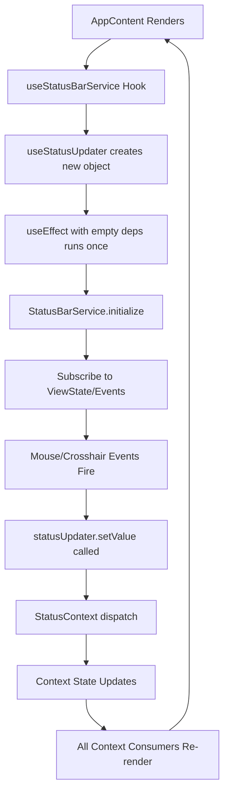

# Flow Report: Render Loop Issue Analysis

## Executive Summary

The render loop issue is caused by a missing dependency in the `useStatusBarService` hook's `useEffect`. The `statusUpdater` from `useStatusUpdater()` is used inside the effect but not included in the dependency array, violating React's Rules of Hooks. This creates a chain reaction where status bar updates trigger context re-renders, which cause AppContent to re-render, creating new hook instances and perpetuating the loop.

## Component Hierarchy and Data Flow

```
App
└── StatusProvider (React Context)
    └── AppContent
        ├── useServicesInit()
        ├── useStatusBarService() ← RENDER LOOP TRIGGER
        ├── MetadataStatusBridge
        └── UI Components
```

## Detailed Execution Flow Analysis

### 1. Initial Mount Sequence

```typescript
// App.tsx:139-149
function App() {
  return (
    <ErrorBoundary>
      <StatusProvider initial={initialStatusSlots}>
        <AppContent />
      </StatusProvider>
    </ErrorBoundary>
  );
}
```

### 2. AppContent Render Cycle

```typescript
// App.tsx:51-127
function AppContent() {
  // Hook execution order is critical
  const renderCount = useRef(0);
  
  // 1. Initialize services (singleton pattern, runs once)
  useServicesInit();
  
  // 2. Other hooks...
  useMountListener();
  useWorkspaceMenuListener();
  
  // 3. PROBLEM HOOK - causes render loop
  useStatusBarService();
  
  // Render loop detection at line 86-107
  renderCount.current++;
  if (renderCount.current > 100) {
    // Bail out to prevent browser crash
  }
}
```

### 3. The Problematic Hook: useStatusBarService

```typescript
// useStatusBarService.ts:10-24
export function useStatusBarService() {
  const statusUpdater = useStatusUpdater(); // ← Creates new memoized object each render
  
  useEffect(() => {
    const service = getStatusBarService();
    service.initialize(statusUpdater);
    
    return () => {
      service.cleanup();
    };
  }, []); // ← EMPTY DEPS - Missing statusUpdater dependency!
}
```

### 4. StatusUpdater Creation Chain

```typescript
// StatusContext.tsx:145-169
export const useStatusUpdater = () => {
  const dispatch = useSetStatus(); // dispatch is stable from useReducer
  
  return useMemo(() => ({
    setValue: (id: string, value: string | ReactNode) => {
      dispatch({ type: 'SET', id, value });
    },
    setBatch: (entries: StatusBatchUpdate) => {
      dispatch({ type: 'BATCH', entries });
    },
    // ...other methods
  }), [dispatch]); // ← Memoized, but creates new object reference each render
};
```

### 5. StatusBarService Initialization and Subscriptions

```typescript
// StatusBarService.ts:40-115
initialize(statusUpdater: StatusUpdater) {
  if (this.isInitialized) {
    console.warn('[StatusBarService] Already initialized, cleaning up first');
    this.cleanup();
  }
  
  this.statusUpdater = statusUpdater;
  
  // Subscribe to Zustand store changes
  const unsubscribeCrosshair = useViewStateStore.subscribe(
    state => state.viewState.crosshair,
    crosshair => {
      if (this.statusUpdater) {
        const formatted = formatCoord(crosshair.world_mm);
        this.statusUpdater.setValue('crosshair', formatted); // ← Updates context
      }
    }
  );
  
  // Subscribe to EventBus events
  const unsubscribeMouseCoord = eventBus.on('mouse.worldCoordinate', (data) => {
    if (this.statusUpdater) {
      this.statusUpdater.setValue('mouse', formatCoord(data.world_mm)); // ← Updates context
    }
  });
  
  // More subscriptions for FPS, GPU status, etc...
}
```

### 6. The Render Loop Mechanism



### 7. Event Flow Analysis

#### ViewState Store Subscriptions
```typescript
// Crosshair position changes frequently
useViewStateStore.subscribe(
  state => state.viewState.crosshair,
  crosshair => {
    statusUpdater.setValue('crosshair', formatted);
  }
);
```

#### EventBus Mouse Events
```typescript
// Mouse movements fire rapidly
eventBus.on('mouse.worldCoordinate', (data) => {
  statusUpdater.setValue('mouse', formatCoord(data.world_mm));
});
```

#### FPS Updates
```typescript
// Render FPS updates frequently
eventBus.on('render.fps', (data) => {
  statusUpdater.setValue('fps', `${data.fps.toFixed(1)} fps`);
});
```

### 8. Context Update Propagation

```typescript
// StatusContext.tsx:20-31
function reducer(state: State, action: Action): State {
  switch (action.type) {
    case 'SET':
      return {
        ...state,
        [action.id]: {
          ...state[action.id],
          value: action.value // ← New state object triggers re-render
        }
      };
  }
}
```

### 9. Additional Contributing Factors

#### MetadataStatusBridge
```typescript
// MetadataStatusBridge.tsx:10-21
export function MetadataStatusBridge() {
  const statusUpdater = useStatusUpdater(); // ← Another instance
  
  useEffect(() => {
    const service = getMetadataStatusService();
    service.setStatusUpdater(statusUpdater);
  }, [statusUpdater]); // ← Correctly includes dependency
}
```

#### Coalescing Middleware
```typescript
// coalesceUpdatesMiddleware.ts - Not contributing to render loop
// Uses requestAnimationFrame to batch backend updates
// Operates independently of React render cycle
```

## Critical Flow Points

### 1. Hook Execution Order (App.tsx)
```typescript
// Lines 55-78
useServicesInit();      // Singleton services
useMountListener();     // Event listeners
useWorkspaceMenuListener();
useStatusBarService();  // ← PROBLEM: Missing dependency
```

### 2. Status Update Chain
```typescript
// StatusBarService → StatusContext → AppContent
MouseEvent → EventBus → StatusBarService.statusUpdater.setValue() 
→ StatusContext.dispatch() → Context State Change 
→ AppContent Re-render → New useStatusUpdater() instance
```

### 3. Subscription Lifecycle
- Subscriptions created in `StatusBarService.initialize()`
- Fire immediately and frequently (mouse, crosshair, FPS)
- Each event triggers context update
- Context updates cause full re-render of AppContent

## Root Cause Summary

1. **Missing Dependency**: `useStatusBarService` has empty dependency array but uses `statusUpdater`
2. **Frequent Events**: Mouse/crosshair/FPS events fire continuously
3. **Context Updates**: Each status update changes React context state
4. **Re-render Cascade**: Context changes trigger AppContent re-render
5. **New Hook Instances**: Re-render creates new `statusUpdater` object (even if memoized)
6. **Stale Closure**: The effect captures the initial `statusUpdater`, but subscriptions keep firing

## Circular Dependency Chain

```
AppContent render
  → useStatusBarService()
    → useStatusUpdater() [new object]
      → useEffect with [] deps [uses stale statusUpdater]
        → StatusBarService subscriptions
          → Events fire (mouse/crosshair/FPS)
            → statusUpdater.setValue()
              → Context dispatch
                → State change
                  → AppContent re-render (loop continues)
```

## Key Code Locations

1. **Root Problem**: `ui2/src/hooks/useStatusBarService.ts:23` - Empty dependency array
2. **Status Updates**: `ui2/src/services/StatusBarService.ts:50-113` - Event subscriptions
3. **Context Updates**: `ui2/src/contexts/StatusContext.tsx:20-31` - State reducer
4. **Render Detection**: `ui2/src/App.tsx:86-107` - Loop detection and bailout
5. **Event Sources**: 
   - `ui2/src/stores/viewStateStore.ts:50-58` - Crosshair subscriptions
   - `ui2/src/events/EventBus.ts:84-95` - Mouse/FPS events

## Performance Impact

- AppContent renders 107+ times before bailout
- Each render creates new hook instances
- Multiple services subscribing to same events
- Continuous state updates from mouse movements
- Browser performance degradation