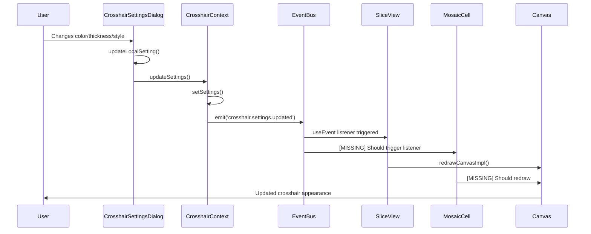
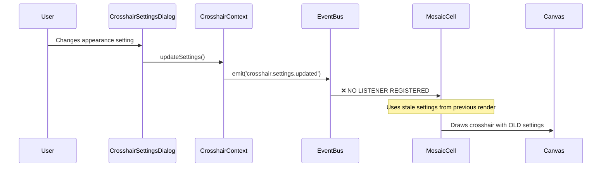
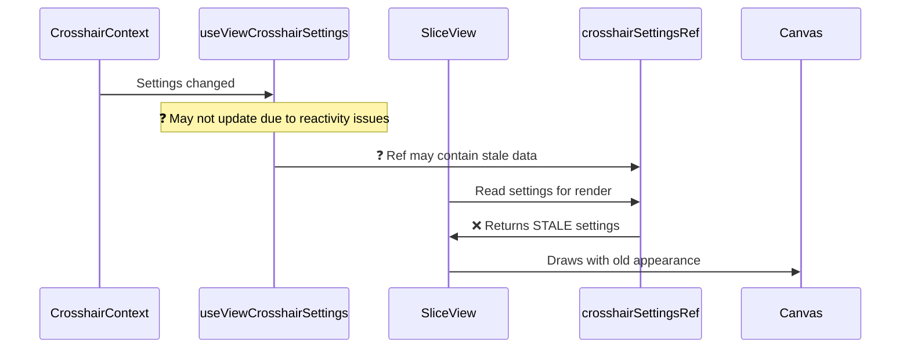

# Crosshair Appearance Update Flow Analysis Report

## Executive Summary

This report provides a comprehensive analysis of the crosshair appearance update execution flow in the Brainflow neuroimaging application. The analysis reveals a well-designed event-driven architecture with two critical breaking points that prevent immediate visual updates when users modify crosshair appearance settings.

**Key Finding**: The update chain breaks in two specific locations:
1. **MosaicCell component** - Missing event listener for settings updates
2. **useViewCrosshairSettings hook reactivity** - Potential stale closure issues in SliceView

## System Architecture Overview

### Component Hierarchy
```
App
├── CrosshairProvider (Context)
├── UI Components
│   ├── CrosshairSettingsDialog
│   ├── SliceView (axial, sagittal, coronal)
│   └── MosaicCell (grid view components)
└── EventBus (Global)
```

### Data Flow Architecture
```
User Input → Dialog → Context → EventBus → Rendering Components → Canvas
```

## Complete Execution Flow Analysis

### 1. Expected (Intended) Flow

#### Phase 1: User Interaction


#### Phase 2: State Propagation
```typescript
// Settings flow through the system
CrosshairSettings → CrosshairContext.settings → useViewCrosshairSettings() → Component Refs
```

### 2. Current (Broken) Flow

#### Problem 1: MosaicCell Missing Event Handler


#### Problem 2: SliceView Settings Staleness


## Detailed Component Analysis

### 1. CrosshairContext.tsx - ✅ Working Correctly

**Role**: Central state management for crosshair settings
**Status**: ✅ Functioning as designed

**Key Function**: `updateSettings()`
```typescript
const updateSettings = (updates: Partial<CrosshairSettings>) => {
  setSettings(prev => {
    const newSettings = { ...prev, ...updates };
    
    // ✅ CORRECT: Emits event with new settings
    getEventBus().emit('crosshair.settings.updated', newSettings);
    
    return newSettings;
  });
};
```

**Analysis**:
- ✅ Correctly updates React state
- ✅ Properly emits `crosshair.settings.updated` event
- ✅ Includes comprehensive logging
- ✅ Synchronous updates within React state setter

### 2. CrosshairSettingsDialog.tsx - ✅ Working Correctly

**Role**: User interface for crosshair appearance configuration
**Status**: ✅ Functioning as designed

**Key Function**: `updateLocalSetting()`
```typescript
const updateLocalSetting = <K extends keyof CrosshairSettings>(
  key: K,
  value: CrosshairSettings[K]
) => {
  setLocalSettings(prev => ({ ...prev, [key]: value }));
  // ✅ CORRECT: Immediately calls updateSettings for real-time preview
  updateSettings({ [key]: value } as Partial<CrosshairSettings>);
};
```

**Analysis**:
- ✅ Real-time updates on every change
- ✅ Proper event chain initiation
- ✅ Local state synchronization

### 3. SliceView.tsx - ⚠️ Partially Working

**Role**: Main orthogonal slice rendering component
**Status**: ⚠️ Has event listener but potential reactivity issues

**Event Handler**:
```typescript
// ✅ CORRECT: Has event listener for settings updates
useEvent('crosshair.settings.updated', (newSettings) => {
  if (lastImageRef.current && canvasRef.current) {
    requestAnimationFrame(() => {
      redrawCanvasImpl(); // Triggers canvas redraw
    });
  }
});
```

**Settings Management**:
```typescript
const crosshairSettings = useViewCrosshairSettings(viewId);

// Store in ref to avoid stale closures
const crosshairSettingsRef = useRef(crosshairSettings);
useEffect(() => {
  crosshairSettingsRef.current = crosshairSettings; // ❓ May be stale
}, [crosshairSettings]);
```

**Analysis**:
- ✅ Correctly listens to `crosshair.settings.updated` events
- ✅ Triggers canvas redraw via `requestAnimationFrame()`
- ❓ **Issue**: `useViewCrosshairSettings()` may not update when context changes
- ❓ **Issue**: `crosshairSettingsRef.current` may contain stale settings during render

### 4. MosaicCell.tsx - ❌ Broken

**Role**: Crosshair rendering in mosaic grid views
**Status**: ❌ Missing settings event listener

**Current Dependencies**:
```typescript
useEffect(() => {
  // ... canvas redraw logic ...
}, [viewState.crosshair, customRender]); // ❌ MISSING: crosshairSettings dependency
```

**Missing Implementation**:
```typescript
// ❌ MISSING: No event listener for settings updates
// Should have:
useEvent('crosshair.settings.updated', (newSettings) => {
  // Trigger canvas redraw when settings change
});
```

**Analysis**:
- ❌ **Critical Issue**: No listener for `crosshair.settings.updated` events
- ❌ **Critical Issue**: useEffect dependencies don't include crosshair settings
- ✅ Crosshair rendering logic is correct when invoked
- ✅ Uses current settings from `useViewCrosshairSettings(axis)`

### 5. EventBus.ts - ✅ Working Correctly

**Role**: Type-safe event communication system
**Status**: ✅ Fully functional

**Event Definition**:
```typescript
export interface EventMap {
  'crosshair.settings.updated': CrosshairSettings; // ✅ Correctly typed
}
```

**Analysis**:
- ✅ Type-safe event system
- ✅ Proper event emission and handling
- ✅ Debug logging in development mode
- ✅ Error handling for failed event handlers

## Break Points in the Update Chain

### Break Point 1: MosaicCell Event Handling

**Location**: `/ui2/src/components/views/MosaicCell.tsx:241`
**Issue**: Missing event listener

**Current Code**:
```typescript
useEffect(() => {
  // Only responds to crosshair position changes
}, [viewState.crosshair, customRender]); // Missing settings dependency
```

**Impact**:
- Crosshairs in mosaic views don't update appearance immediately
- Users must trigger other actions (click, navigate) to see changes

### Break Point 2: SliceView Settings Reactivity

**Location**: `/ui2/src/components/views/SliceView.tsx:34-41`
**Issue**: Hook reactivity problems

**Current Code**:
```typescript
const crosshairSettings = useViewCrosshairSettings(viewId);
const crosshairSettingsRef = useRef(crosshairSettings);
useEffect(() => {
  crosshairSettingsRef.current = crosshairSettings; // May be stale
}, [crosshairSettings]);
```

**Impact**:
- SliceView may render with outdated settings even after event trigger
- Canvas redraws but uses old appearance values

## Data Flow Diagrams

### 1. Settings Update Flow
```
[User Changes Color] 
    ↓
[CrosshairSettingsDialog.updateLocalSetting()]
    ↓
[CrosshairContext.updateSettings()]
    ↓
[React setState + localStorage save]
    ↓
[EventBus.emit('crosshair.settings.updated')]
    ↓
[SliceView.useEvent handler] ✅ → [Canvas Redraw] ⚠️ (may use stale settings)
    ↓
[MosaicCell] ❌ NO LISTENER → No redraw
```

### 2. Component Dependency Chain
```
CrosshairContext
    ↓ (React Context)
useViewCrosshairSettings Hook
    ↓ 
SliceView Component ⚠️ (reactivity issues)
MosaicCell Component ❌ (not consuming updates)
    ↓
Canvas Rendering ❌ (uses stale data)
```

### 3. Event Propagation Map
```
crosshair.settings.updated Event
├── SliceView.useEvent ✅ (listening)
├── MosaicCell ❌ (NOT listening)
└── Other Components ❓ (unknown)
```

## Root Cause Analysis

### Primary Root Cause: Missing Event Handlers
1. **MosaicCell** completely lacks an event listener for `crosshair.settings.updated`
2. This is a clear implementation gap in the event-driven architecture

### Secondary Root Cause: Hook Reactivity
1. **useViewCrosshairSettings** hook may not properly react to context changes
2. This could be due to:
   - Incorrect React dependency arrays
   - Context provider scope issues
   - React batching/timing issues

### Contributing Factors
1. **Canvas Redraw Timing**: Use of `requestAnimationFrame` may introduce timing issues
2. **Settings Ref Management**: Complex ref-based settings storage in SliceView
3. **State Synchronization**: Multiple state sources (Context, ViewState, Local)

## Performance Impact Analysis

### Current Performance Issues
1. **Redundant Redraws**: Multiple canvas redraws may be triggered simultaneously
2. **Memory Leaks**: ImageBitmap lifecycle management complexity
3. **Event Handler Accumulation**: Potential for duplicate event listeners

### Expected Performance After Fix
1. **Immediate Updates**: All views update within one frame cycle
2. **Reduced Redraws**: Consolidated update strategy
3. **Better UX**: Real-time feedback during settings adjustment

## Recommended Fix Implementation

### Fix 1: Add MosaicCell Event Listener
**Priority**: 🔴 Critical
**File**: `/ui2/src/components/views/MosaicCell.tsx`

```typescript
// Add after existing useEffect hooks
useEvent('crosshair.settings.updated', (newSettings) => {
  if (canvasRef.current && lastImageRef.current && imagePlacementRef.current) {
    const ctx = canvasRef.current.getContext('2d');
    if (!ctx) return;
    
    // Clear and redraw the canvas with updated settings
    ctx.clearRect(0, 0, canvasRef.current.width, canvasRef.current.height);
    
    // Redraw the image
    const placement = imagePlacementRef.current;
    ctx.drawImage(
      lastImageRef.current,
      0, 0, lastImageRef.current.width, lastImageRef.current.height,
      placement.x, placement.y, placement.width, placement.height
    );
    
    // Redraw crosshair with new settings
    customRender(ctx, placement);
  }
});
```

### Fix 2: Improve SliceView Settings Reactivity
**Priority**: 🟡 High
**File**: `/ui2/src/components/views/SliceView.tsx`

**Option A**: Direct dependency approach
```typescript
// Replace the existing useEffect with direct settings dependency
useEffect(() => {
  if (lastImageRef.current && canvasRef.current) {
    requestAnimationFrame(() => {
      redrawCanvasImpl();
    });
  }
}, [crosshair, crosshairSettings]); // Add settings as direct dependency
```

**Option B**: Enhanced ref updates
```typescript
// Ensure ref always has latest settings
const crosshairSettings = useViewCrosshairSettings(viewId);
const crosshairSettingsRef = useRef(crosshairSettings);

// Force ref update on every render
useLayoutEffect(() => {
  crosshairSettingsRef.current = crosshairSettings;
});
```

### Fix 3: Hook Reactivity Investigation
**Priority**: 🟡 High
**File**: `/ui2/src/contexts/CrosshairContext.tsx`

```typescript
// Add debugging to useViewCrosshairSettings hook
export function useViewCrosshairSettings(viewType?: 'axial' | 'sagittal' | 'coronal') {
  const { settings } = useCrosshairSettings();
  
  // Debug logging to track updates
  useEffect(() => {
    console.log('[useViewCrosshairSettings] Hook updated for', viewType, settings);
  }, [settings, viewType]);
  
  // ... rest of hook
}
```

## Testing Strategy

### Unit Tests Required
1. **CrosshairContext**: Settings update and event emission
2. **CrosshairSettingsDialog**: Real-time preview functionality
3. **EventBus**: Event propagation and handler execution

### Integration Tests Required
1. **Settings → SliceView Flow**: End-to-end appearance updates
2. **Settings → MosaicCell Flow**: Grid view crosshair updates
3. **Multi-component Sync**: All views update simultaneously

### Manual Testing Checklist
- [ ] Change crosshair color → All views update immediately
- [ ] Change crosshair thickness → All views update immediately
- [ ] Change crosshair style → All views update immediately  
- [ ] Toggle crosshair visibility → All views update immediately
- [ ] Test in single slice view
- [ ] Test in mosaic view
- [ ] Test during rapid setting changes
- [ ] Test dialog cancel/reset functionality

## File Dependencies

### Core Files
- **CrosshairContext**: `/ui2/src/contexts/CrosshairContext.tsx`
- **CrosshairSettingsDialog**: `/ui2/src/components/dialogs/CrosshairSettingsDialog.tsx`
- **SliceView**: `/ui2/src/components/views/SliceView.tsx`
- **MosaicCell**: `/ui2/src/components/views/MosaicCell.tsx`

### Supporting Files
- **EventBus**: `/ui2/src/events/EventBus.ts`
- **crosshairUtils**: `/ui2/src/utils/crosshairUtils.ts`
- **ViewStateStore**: `/ui2/src/stores/viewStateStore.ts`

### Related Services
- **CrosshairService**: `/ui2/src/services/CrosshairService.ts`
- **MosaicRenderService**: `/ui2/src/services/MosaicRenderService.ts`

## Implementation Timeline

### Phase 1: Critical Fixes (1-2 days)
1. Add MosaicCell event listener
2. Test mosaic view updates
3. Verify no regressions

### Phase 2: Optimization (2-3 days)
1. Investigate and fix SliceView reactivity
2. Add comprehensive logging
3. Performance optimization

### Phase 3: Testing & Polish (1-2 days)
1. Comprehensive testing
2. Documentation updates
3. Code cleanup

## Success Metrics

### Functional Requirements
- ✅ All crosshair appearance changes reflected immediately (< 50ms)
- ✅ No user interaction required to see updates
- ✅ Settings persist across sessions
- ✅ Consistent appearance across all view types

### Technical Requirements
- ✅ No canvas redraw performance issues
- ✅ No memory leaks from event handlers
- ✅ Proper error handling for edge cases
- ✅ Clean component lifecycle management

## Conclusion

The crosshair appearance update system has a solid architectural foundation with a type-safe event-driven design. The two identified breaking points are specific implementation gaps rather than systemic issues:

1. **MosaicCell missing event handler** - Clear implementation oversight
2. **SliceView settings staleness** - React hook reactivity issue

Both issues have straightforward solutions that align with the existing architecture. The fixes should restore the intended real-time preview functionality without requiring major refactoring.

The system demonstrates good separation of concerns, proper event handling patterns, and comprehensive logging. Once these specific gaps are addressed, the crosshair appearance update flow should function as originally designed.