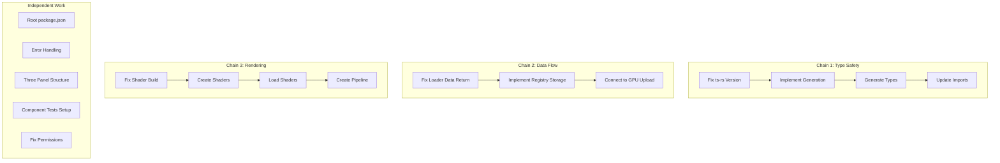

# Technical Debt Task Assignment Plan

**Role:** Architecture & Management  
**Date:** 2025-01-21  
**Objective:** Decompose 42 debt items into truly independent sub-tasks with clear sequencing

## Task Decomposition Strategy

### Principles
1. **True Independence**: Sub-tasks must be completable without waiting for others
2. **Atomic Units**: Each sub-task produces a working result
3. **Clear Dependencies**: Sequential work explicitly ordered
4. **Parallel Maximization**: Extract all possible parallel work

## Critical Path Analysis

### Blocking Chains Identified

## Sprint 0: Parallel Task Assignments

### Independent Task Pool (Can ALL start Day 1)

#### Package 1: Infrastructure Quick Wins (2 hours total)
**Assignee**: Any developer
- [ ] SUB-001: Create root package.json with scripts
- [ ] SUB-002: Update .github/workflows/ci.yml to use root scripts
- [ ] SUB-003: Create vitest.config.ts in ui/
- [ ] SUB-004: Fix plugin-verify schema path
- [ ] SUB-005: Update Tauri metadata in src-tauri/Cargo.toml

#### Package 2: Rust Error Handling (3 days)
**Assignee**: Rust Developer A
- [ ] SUB-006: Replace unwrap() in api_bridge/src/lib.rs
- [ ] SUB-007: Replace unwrap() in render_loop/src/lib.rs
- [ ] SUB-008: Implement BridgeError From traits
- [ ] SUB-009: Add error context with anyhow
- [ ] SUB-010: Create user-friendly error messages

#### Package 3: UI Structure Preparation (3 days)
**Assignee**: Frontend Developer B
- [ ] SUB-011: Create three-canvas layout in VolumeView.svelte
- [ ] SUB-012: Add canvas ID management (axial/coronal/sagittal)
- [ ] SUB-013: Implement resize handling for three canvases
- [ ] SUB-014: Add view labels and orientation indicators
- [ ] SUB-015: Create ViewType enum and props

#### Package 4: Test Infrastructure (2 days)
**Assignee**: Frontend Developer C
- [ ] SUB-016: Set up @testing-library/svelte utilities
- [ ] SUB-017: Create test wrapper for Svelte 5 components
- [ ] SUB-018: Write TreeBrowser.test.ts
- [ ] SUB-019: Write layerStore.test.ts
- [ ] SUB-020: Document testing patterns

#### Package 5: Documentation & Cleanup (1 day)
**Assignee**: Any developer
- [ ] SUB-021: Document shader pipeline in render_loop/README.md
- [ ] SUB-022: Create core/filesystem/README.md or remove module
- [ ] SUB-023: Update memory-bank/activeContext.md
- [ ] SUB-024: Create CONTRIBUTING.md with debt reduction process

### Sequential Chain 1: Type Generation (4 days)
**Assignee**: Full-Stack Developer D

#### Phase 1: Fix Infrastructure (Day 1)
- [ ] SEQ-001: Update xtask/Cargo.toml to use workspace ts-rs version
- [ ] SEQ-002: Add TS_RS_EXPORT_DIR env var to xtask
**Gate**: Version alignment complete

#### Phase 2: Implement Generation (Day 2)
- [ ] SEQ-003: Implement type collection in xtask
- [ ] SEQ-004: Generate types from bridge_types crate
- [ ] SEQ-005: Generate types from api_bridge crate
**Gate**: Types generate to packages/api/src/generated/

#### Phase 3: Integration (Day 3-4)
- [ ] SEQ-006: Update packages/api/src/index.ts imports
- [ ] SEQ-007: Remove manual type duplications
- [ ] SEQ-008: Fix TypeScript compilation errors
- [ ] SEQ-009: Add type generation to CI
**Gate**: UI compiles with generated types

### Sequential Chain 2: Shader Pipeline (3 days) ✅ COMPLETED
**Assignee**: Rust Developer E  
**Status**: Completed 2025-01-22

#### Phase 1: Build System (Day 1) ✅
- [x] SEQ-010: Research wgpu 0.20 shader compilation options
- [x] SEQ-011: Implement shader compilation in build.rs (runtime loading chosen)
- [x] SEQ-012: Create shaders/ directory structure
**Gate**: Shaders compile during build ✅ PASSED

#### Phase 2: Shader Creation (Day 2) ✅
- [x] SEQ-013: Write slice_render.vert (vertex shader) - combined in slice.wgsl
- [x] SEQ-014: Write slice_render.frag (fragment shader) - combined in slice.wgsl
- [x] SEQ-015: Add shader validation and error reporting
**Gate**: Shaders validate without errors ✅ PASSED

#### Phase 3: Runtime Loading (Day 3) ✅
- [x] SEQ-016: Load shaders in RenderLoopService
- [x] SEQ-017: Create shader module and pipeline state management
- [x] SEQ-018: Add shader hot-reload for development
- [x] SEQ-019: Add shader error handling
**Gate**: Shaders load at runtime ✅ PASSED

**Additional Deliverables Completed**:
- Pipeline caching and reuse
- Layer uniform buffer management
- Texture atlas binding
- Colormap texture support

### Sequential Chain 3: Data Flow (4 days)
**Assignee**: Rust Developer F

#### Phase 1: Loader Fix (Day 1-2)
- [ ] SEQ-020: Implement NiftiLoader::load body
- [ ] SEQ-021: Create VolumeData struct for full data
- [ ] SEQ-022: Test with toy_t1w.nii.gz
**Gate**: Loader returns actual volume data

#### Phase 2: Registry Implementation (Day 3)
- [ ] SEQ-023: Create VolumeRegistry in api_bridge
- [ ] SEQ-024: Store loaded volumes with handles
- [ ] SEQ-025: Implement handle lookup
**Gate**: Volumes stored and retrievable

#### Phase 3: GPU Connection (Day 4)
- [ ] SEQ-026: Implement request_layer_gpu_resources
- [ ] SEQ-027: Extract slice data for GPU upload
- [ ] SEQ-028: Return GPU resource info
**Gate**: Data ready for GPU upload

## Sprint 1: Building on Foundation

### Prerequisites from Sprint 0
- Type generation working (Chain 1)
- Shaders loading (Chain 2)  
- Data flow complete (Chain 3)

### New Independent Tasks

#### Package 6: GPU Pipeline (3 days)
**Assignee**: Rust Developer A
- [ ] SUB-025: Create render pipeline
- [ ] SUB-026: Implement bind groups
- [ ] SUB-027: Connect texture atlas
- [ ] SUB-028: Implement actual rendering

#### Package 7: API Additions (1 day)
**Assignee**: Full-Stack Developer D
- [ ] SUB-029: Add update_frame_ubo command
- [ ] SUB-030: Add set_crosshair command
- [ ] SUB-031: Update TypeScript wrappers

#### Package 8: Performance Setup (2 days)
**Assignee**: Rust Developer E
- [ ] SUB-032: Add criterion benchmarks
- [ ] SUB-033: Implement texture upload benchmark
- [ ] SUB-034: Add frame timing metrics
- [ ] SUB-035: Create performance dashboard

## Resource Allocation Matrix

### Developer Profiles Needed
1. **Rust Developer A**: Error handling, GPU pipeline
2. **Frontend Developer B**: UI structure, components
3. **Frontend Developer C**: Testing, documentation
4. **Full-Stack Developer D**: Type generation, API
5. **Rust Developer E**: Shaders, performance
6. **Rust Developer F**: Data flow, loaders

### Daily Allocation (Sprint 0)

| Day | Rust A | Frontend B | Frontend C | Full-Stack D | Rust E | Rust F |
|-----|--------|------------|------------|--------------|--------|--------|
| 1 | SUB-006 | SUB-011 | SUB-016 | SEQ-001-002 | SEQ-010 | SEQ-020 |
| 2 | SUB-007 | SUB-012 | SUB-017 | SEQ-003-005 | SEQ-011-012 | SEQ-021 |
| 3 | SUB-008 | SUB-013 | SUB-018 | SEQ-006 | SEQ-013-014 | SEQ-022 |
| 4 | SUB-009 | SUB-014 | SUB-019 | SEQ-007 | SEQ-015 | SEQ-023 |
| 5 | SUB-010 | SUB-015 | SUB-020 | SEQ-008 | SEQ-016-017 | SEQ-024 |
| 6 | Review | Review | SUB-001-005 | SEQ-009 | SEQ-018 | SEQ-025 |
| 7 | Buffer | Buffer | Docs | Buffer | SEQ-019 | SEQ-026 |
| 8 | Integration | Integration | Integration | Integration | Buffer | SEQ-027 |
| 9 | Testing | Testing | Testing | Testing | Testing | SEQ-028 |
| 10 | Sprint Review | Sprint Review | Sprint Review | Sprint Review | Sprint Review | Sprint Review |

## Dependency Gates

### Hard Gates (Must Complete Before Next)
1. **Type Generation**: SEQ-001-002 → SEQ-003-005 → SEQ-006-009
2. **Shader Pipeline**: SEQ-010-012 → SEQ-013-015 → SEQ-016-019
3. **Data Flow**: SEQ-020-022 → SEQ-023-025 → SEQ-026-028

### Soft Dependencies (Preferred Order)
1. Root package.json helps testing setup
2. Error handling helps all development
3. Three-panel structure helps GPU integration

## Risk Mitigation

### Parallel Work Risks
- **Risk**: Developer unavailable
- **Mitigation**: Each package can be reassigned as a unit

### Sequential Work Risks
- **Risk**: Gate blocked by technical issue
- **Mitigation**: Architect available for unblocking

### Integration Risks
- **Risk**: Components don't integrate
- **Mitigation**: Daily integration checks in standup

## Success Metrics

### Sprint 0 Completion
- 24 independent sub-tasks: 100% complete
- 28 sequential tasks: All gates passed
- 0 critical blockers remaining

### Velocity Tracking
- Independent tasks: Should complete at steady rate
- Sequential chains: Monitor gate completion
- Blockers: Should decrease daily

## Architecture Decisions

### Why These Decompositions

1. **Infrastructure First**: Quick wins build momentum
2. **Parallel Preparation**: UI can prepare while Rust works
3. **Sequential Isolation**: Each chain has one owner
4. **Buffer Time**: Built into sequential estimates
5. **Integration Points**: Explicit in schedule

### Non-Negotiable Sequences

1. Cannot generate types before fixing versions
2. Cannot load shaders before they compile
3. Cannot upload to GPU before data exists
4. Cannot render before pipeline exists

## Next Steps

1. Assign developers to profiles
2. Create feature branches for each package
3. Start all independent packages on Day 1
4. Monitor sequential gates daily
5. Integrate completed work frequently

This plan maximizes parallelism while respecting true dependencies. The key is starting all independent work immediately while carefully managing the three critical sequential chains.