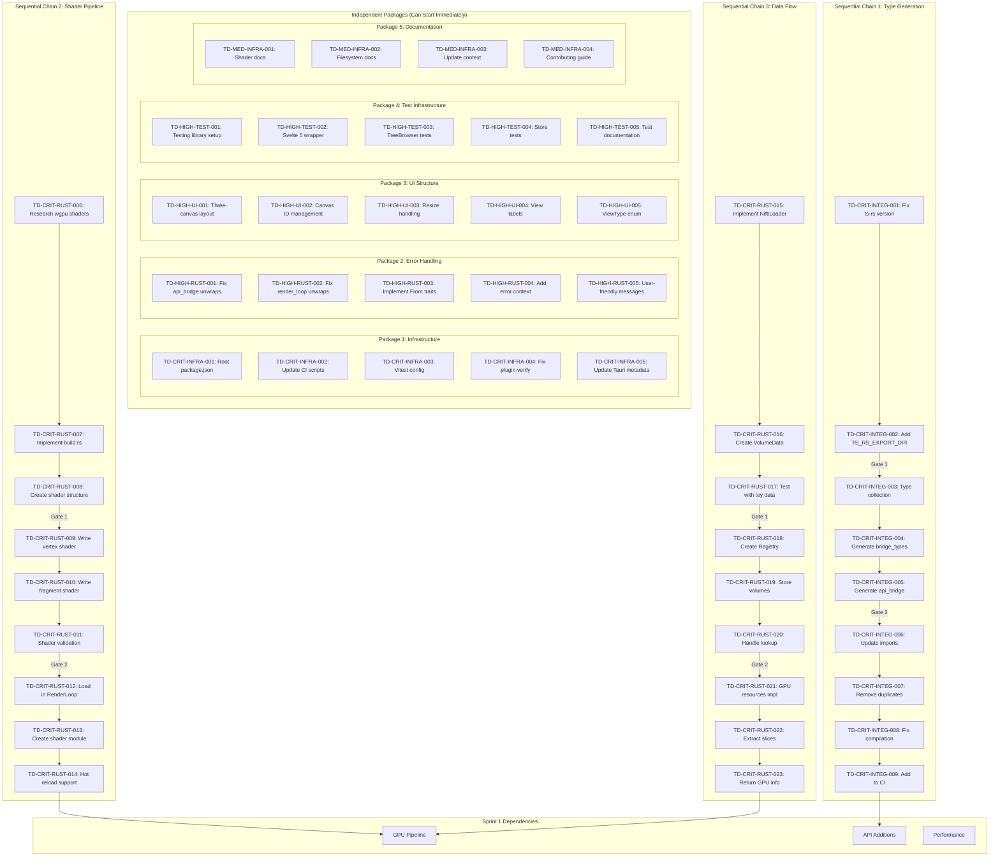

# Ticket Dependency Graph

**Last Updated:** 2025-01-21  
**Total Tickets:** 52 (24 independent + 28 sequential)

## Dependency Visualization

## Critical Path

The critical path runs through all three sequential chains, which must complete before Sprint 1 GPU work can begin:

1. **Type Generation** (4 days) - Blocks API additions
2. **Shader Pipeline** (3 days) - Blocks GPU pipeline
3. **Data Flow** (4 days) - Blocks GPU pipeline

**Total Critical Path:** 11 days (with parallel execution: 4 days)

## Dependency Rules

### Independent Packages
- Can be started by any available developer
- Have no blockers or dependencies
- Can be completed in any order
- Should be distributed for maximum parallelism

### Sequential Chains
- Must be completed in exact order
- Gates prevent proceeding until verified
- Single owner recommended for continuity
- Buffer time included in estimates

### Cross-Dependencies
- UI Structure (Package 3) helps GPU integration testing
- Error Handling (Package 2) helps all development
- Type Generation (Chain 1) enables UI TypeScript work

## Sprint Boundaries

### Sprint 0 Must Complete
- All 5 independent packages
- All 3 sequential chains
- 0 critical blockers remaining

### Sprint 1 Can Start When
- Type generation working (Chain 1 done)
- Shaders loading (Chain 2 done)
- Data available (Chain 3 done)

### Sprint 2 Prerequisites
- GPU pipeline rendering
- Basic UI displaying data
- Performance baselines established

## Tracking Checklist

### Daily Checks
- [ ] No sequential task started before predecessor
- [ ] Gates verified before proceeding
- [ ] Independent work distributed
- [ ] Blockers identified early

### Sprint Checks
- [ ] Critical path on schedule
- [ ] Dependencies respected
- [ ] Integration points tested
- [ ] No orphaned work

---

**Note:** This dependency graph is the source of truth for task ordering. Any deviation requires architectural approval.